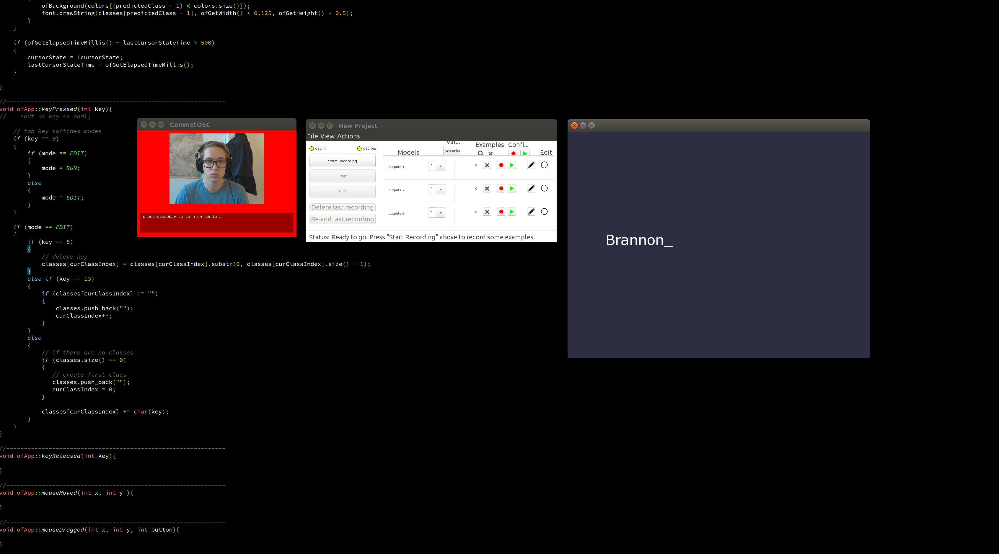

# Wekinator Class Viewer

Tiny (so teeny) OpenFrameworks application to label and display single class output from Wekinator over OSC. Useful for demos and lectures. Built with OpenFrameworks v0.9.8 using the ofxOsc addon.